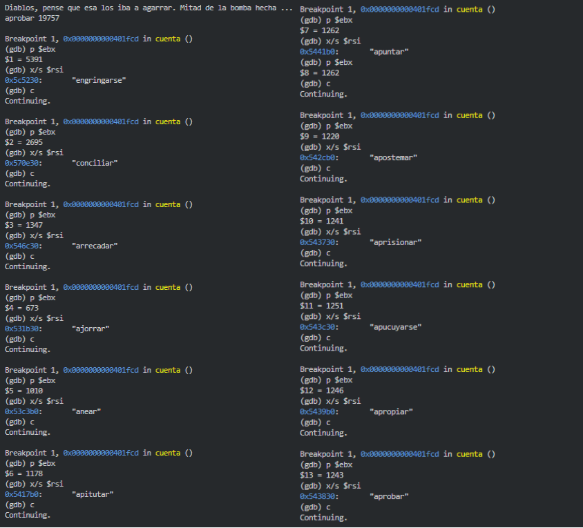
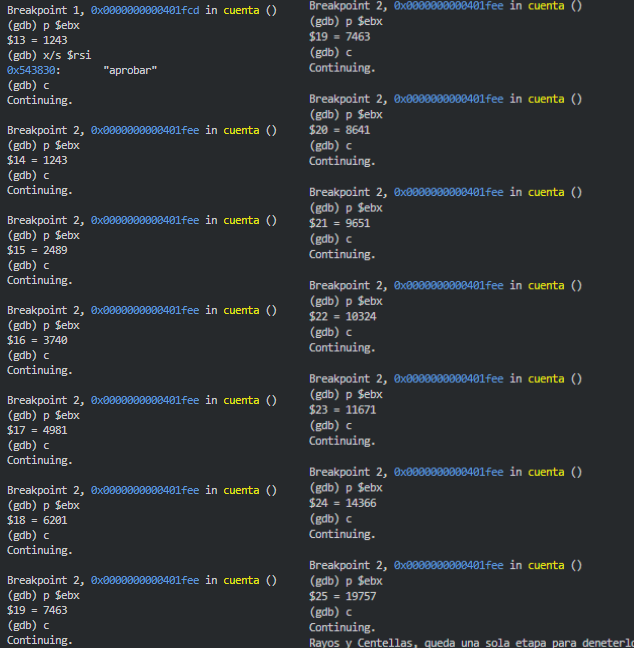

_(*Disculpas si quedan algunas cosas del formato no tan prolijas. Lo hice todo en txt y como pospusieron la entrega, a ultimo momento dije ya fue y lo pase a markdown y le clave todos los line breaks (\ )_

Nombre & Apellido: Manuel Meiriño
Email: mmeirino@udesa.edu.ar
Legajo: 35723

En este archivo resumo brevemente las lineas clave de cada fase realizada de la bomba, y como desactivarlas.
Se llego a estas conclusiones con una combinacion de leer el desensamblado de la bomba en un .txt, y usar el gdb para debuggear por paso y por linea (las primeras 2 fases apenas requirieron debugger, en la tercera fue muy util).

# [Phase 1]
Mire el codigo de la Fase 1 y vi que llamaba un strings_not_equal 
Pero antes de llamar a la funcion con el string correcto cargado, dejaba con un comentario arriba  
En el comentario mostraba cual era la direccion del string guardado en rsi (0x4c9a58)  
Asi que simplemente puse un breakpoint en phase_1, y cuando llegue al breakpoint, corri: 
x/s 0x4c9a58 
para obtener el string, y obtuve "Cada uno es como Dios le hizo, y aun peor muchas veces."

# [Phase 2]
Busco phase_2 en el assembly.txt, encuentro 
Veo que guarda tres valores, con cada (call 406890 <__strtol>) y subsecuente mov  
En los movs de abajo guarda rbp, rbx & eax.  Estos siendo mis 3 inputs, que viendo el resto del codigo puedo tomar que van a ser numeros enteros.
rbp = a, rbx = b, eax = c. 

401e94 hace xor ebx,ebp.
Lo cual hace el xor entre (a, b), con ebx y ebp siendo sus versiones de 32 bits para poder hacer el xor, dando (a ^ b) 
Luego del XOR hace un shift right (sar ebx,1), por lo cual el resultado pasa a ser ((a ^ b) >> 1) 
Luego hace un compare en 'cmp ebx,eax', comparando el valor.

401e9a hace 'jne 401eb7 \<phase_2+0x95>', un "jump if not equal",  
Entonces si no dieron iguales, salta directamente a la instruccion 401eb7, que es indeed, explode_bomb  
Mientras que si dieron iguales, sigue con la logica, haciendo 'mov edi,r12d'. Por lo cual ((a ^ b) >> 1) tiene que ser igual a c  
Y luego pasando a 'call 401e0b \<misterio>'.

\<misterio> esta definida arriba, y dentro de ella se ve un (test edi,edi) que setea su flag de signo al llamarlas (un and entre dos  
variables iguales no va a hacer nada realmente, es como un AND que no modifica nada mas, usado para tener las flags para la linea siguiente).  
Y despues viene la linea realmente importante aca, que es 'js 401e21 \<misterio+0x16>'  
Es decir, Jump if Sign, tal que si tiene signo negativo, salta a 401e21 (ret de misterio, pasamos de forma segura)
Y si el signo no es negativo, sigue con las lineas de \<misterio>, encontrando un \<explode_bomb> inmediatamente.
Entonces, sabemos que el valor edi que ingrese a misterio debe ser negativo para que no explote.

Recordemos que antes de pasar a misterio se corrio un 'mov edi,r12d', y si chequeamos mas arriba, r12d guardaba el valor de eax  
En la linea 'mov r12d,eax' que se inmediatamente abajo del tercer strtol. Por lo cual, la variable de input que debe ser negativa.  
Entonces, ya tenemos todas nuestras condiciones :)

Hay 3 integers de inputs (que llamamos a, b, c), y sabemos que tienen que cumplir: 
- ((a ^ b) >> 1) == c
- c < 0

Hay varias combinaciones de 3 digitos que cumplen esto, una de ellas siendo por ejemplo: 
a = -2
b = 1
c = -1

# [Phase 3]
Para empezar, me di cuenta que la Fase 3, en \<cuenta> ejecuta una busqueda binaria.  
Con el debugger lo podes ver si vas guardando los valores y viendo la recursividad,  
pero para verlo desde afuera, voy a ir mostrando mas o menos las lineas mas importantes que lo resaltan.

Lo voy a estructurar en 
- como se el formato
- como se donde busca?
- como se que es busqueda binaria & recursiva?
- como se que combinaciones son validos?

### Como se el formato del input? (lineas clave)
Al inicio de phase_3, el programa llama a 'call 407500 <__isoc99_sscanf>'. Antes de eso, prepara los argumentos: 'lea rsi,[rip+0xc503d]' carga el formato, que apunta a "%s %d", indicando que espera una palabra y un número. El input de ahi se pasa de rbx a rdi.

Luego, se verifica si se leyeron exactamente dos elementos con 'cmp eax,0x2' y si no se cumple, va a 'jne 4020ea \<explode_bomb>', asi que el input tiene que si o si tener 2 elementos. Despues en 'mov ebp,DWORD PTR [rsp+0x4]', se guarda el número (para despues el chqeueo). Chequeo que hace en 'cmp DWORD PTR [rsp],ebx', comparando con el ebx que ahora va a empezar a aparecer bastante.

### Como se donde las busca? (lineas clave)
Esto se ve en la funcion \<readlines>, que arranca abriendo un archivo con 'call 410ad0 <_IO_new_fopen>'. El nombre del archivo proviene de la línea 'lea rdi,[rip+0xc519d]', que apunta a la string "palabras.txt". Luego, se leen las líneas una a una con 'call 4074e0 <__getline>', y cada línea se guarda en el arreglo de punteros mediante 'mov [r12+rbx*8], rax'. Y de ahi arranca con la busqueda...

### Como se que es Binaria (lineas clave)?
Descubri que usa un truquito, aprovechando que (a + b) = (a ^ b) + 2 * (a & b)
Para dividir ambos por 2, y dar con (a + b) / 2 = (a ^ b) / 2 + (a & b)
Como se ve en las lineas exactas:
'(xor ebx, ecx)'; (hace el a^b)
'(sar ebx,1)'; (hace el /2 usando >>1)
'(and eax, ecx)'; (jace el a&b)
'(add ebx, eax)' (suma el a&b)

### Como se que es recursiva (lineas clave)?
(primero que nada, es binaria, no tendria mucho sentido no hacerla recursiva tbh, o solo buscaba la palabra del medio sino)
Pero, lo confirmo con el debugger, y visto desde afuera, se puede ver con las lineas 
'je 401fee \<cuenta+0x4b>' (se cumple el caso recursivo, hace los pops y el ret despues)
'js 401ff9 \<cuenta+0x56>' (salta a la parte de cuenta en 401ff9, cuando en indice mas bajo que la mitad, busca la parte de abajo)
(si no se cumple ni el Sign ni el Flag, entonces hace el caso en el que el indice esmas alto que la mitad, busca la parte de arriba)
'call 401fa3 \<cuenta>' (llama a la recu, volviendo al principio de cuenta)

### Como se que hace con la busqueda?
Bueno, dificil de que quede tan claro asi en el markdown. La verdad es que con el debugger se ve completamente claro, asi que dejo estas imagenes:

Y en terminos de codigo, en \<cuenta> va haciendo la recursion hasta llegar a la palabra, y por cada una que pasa en el camino, va guardando los pasos del camino y despues hace 'add ebx,eax' por cada paso, y va sumando y sumando hastaque ebx sea la suma de todos los indices de todos los pasos. 

Asi que sabiendo eso, simplemente arme un script de python que haga la busqueda binaria en palabras.txt y sume indices, dada la palabra que quiera, y de ahi le tiro un ejemplo. Personalmente elegi "aprobar" a ver si me traia mejor suerte, y bueno, "aprobar 19757" y el preciado mensaje 'Rayos y Centellas'. 

# [Phase 4]